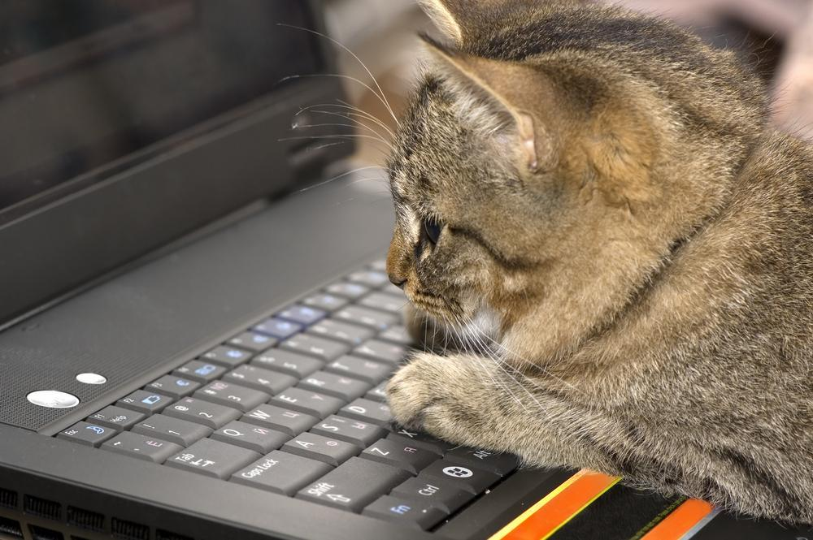

# Hi, I'm 余林杨 👋

### Agent Developer · Master of Artificial Intelligence at UNSW

## About Me

- 🤖 Focused on Agent application development and Agentic systems engineering
- 🧩 Interested in Agent Runtime, Harness, Planner, Tool Calling, Skills, Subagents, and Memory
- 🔍 Experienced with RAG, MCP, context management, permission control, and human-in-the-loop workflows

## Featured Project

### AlphaStock — Financial Quantitative Analysis Self-Evolving Agent

An event-driven Agent system for financial analysis with supervised self-evolution.

- Built an InvestmentRuntime to manage task state, context, model configuration, and Agentic Loops.
- Designed restricted Skill/Subagent orchestration with permission limits, call limits, output gates, deduplication, and execution tracing.
- Implemented document understanding with MinerU, PyMuPDF/OCR fallback, page-level citations, and version-aware evidence extraction.
- Combined pgvector HNSW, BM25, and Reciprocal Rank Fusion for news retrieval, reaching an offline Recall@10 of 0.8707.
- Developed a layered context and memory pipeline from Transcript to SessionMemory and ContextWindow Builder under a strict token budget.

## Open-Source Contributions

- **DeerFlow** —
- **HiveMind** —

## Contact

📧 [yulingyu08@gmail.com](mailto:yulingyu08@gmail.com)

---

  

